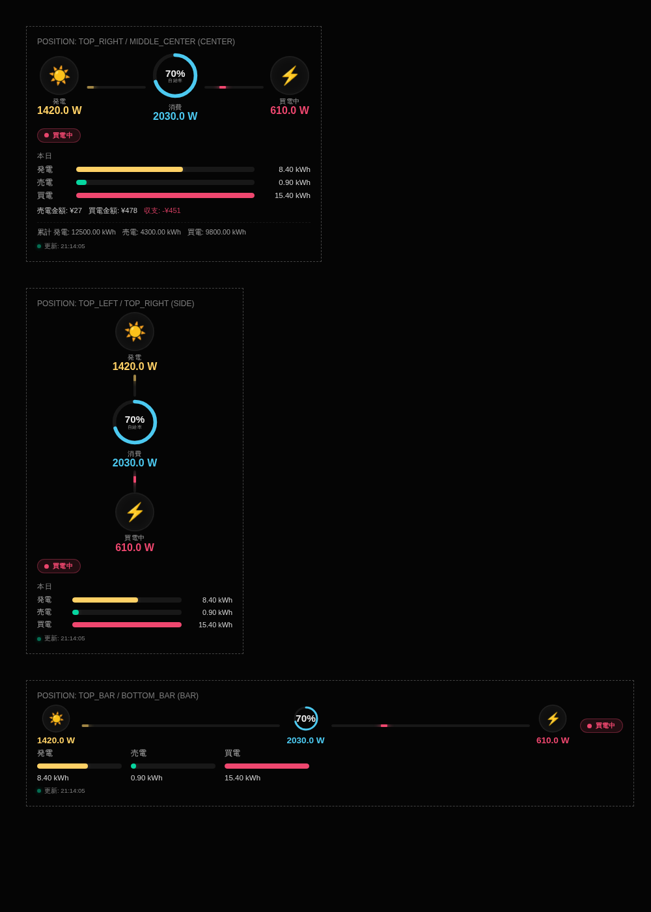
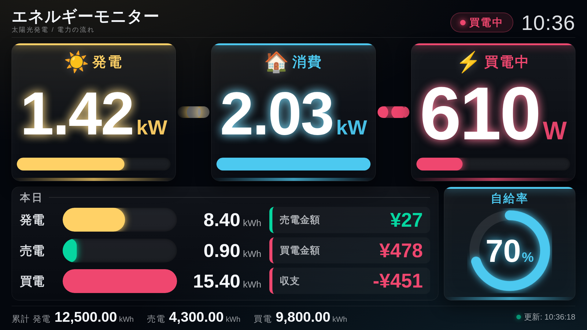

# MMM-HomePowerMonitor_forPanasonic

A [MagicMirror²](https://magicmirror.builders/) module that connects **directly over your local network** to a
Panasonic energy-monitor **power detection unit** (電力検出ユニット), such as the **VBPX274**, and displays a modern,
animated "energy flow" dashboard: solar generation → home consumption → grid (buy/sell), plus today's and
lifetime totals.

No cloud service, no API key — the module talks straight to the device's built-in `getinfo.cgi` HTTP endpoint on
your LAN. The endpoint is protected by **HTTP Basic authentication**, so the device's `username` / `password` are
required in the config.



> The screenshot above shows the same component rendered in the three supported layout widths: `center`
> (top_right / middle_center, etc.), `side` (top_left / bottom_right, etc.) and `bar` (top_bar / bottom_bar).

## Features

- 🔌 **Direct LAN polling** of the Panasonic power detection unit — no internet, no third-party cloud account.
- ⚡ **Animated power-flow diagram**: an animated dot travels along the connection line between Solar → Home →
  Grid. The dot's speed reacts to the actual power level (faster = more watts).
- 🔁 **Automatic buy/sell switching**: the grid node and its flow direction automatically flip between "selling"
  (green, flowing out) and "buying" (red, flowing in) based on live data.
- 🌞 **Self-Sufficiency Ratio (SSR) ring** — an animated donut chart in the "home" node shows what percentage of
  your current consumption is covered by your own solar generation.
- 📊 **Today's summary bar chart** — generation / sell / buy energy (kWh) as animated bar charts, plus sell
  income, buy cost and net balance in yen.
- ♾️ **Lifetime totals** footer (since the device was installed).
- 📱 **Responsive layouts** — the component automatically adapts between the MagicMirror `bar` regions
  (`top_bar` / `bottom_bar`, wide & short) and `side`/`center` regions (`top_left`, `top_right`, `middle_center`,
  etc., narrower & taller). See [Positioning notes](#positioning-notes) below.
- 🖥️ **Fullscreen "kiosk" dashboard** — with `fullscreen_above` / `fullscreen_below` the module switches to a
  dedicated whole-screen layout in the style of the energy-visualisation panels found in shops and showrooms:
  huge tabular numbers (up to ~270 px tall on Full HD), thick magnitude meters, a large self-sufficiency gauge
  and a clock — all readable from across the room. See
  [Fullscreen (kiosk) layout](#fullscreen-kiosk-layout) below.
- 🌐 **i18n**: English and Japanese translations included.
- 🛠 A **mock device server** (`demo/mock-device.js`) is included so you can develop/preview the module without
  real hardware.

## Screenshot

See [`docs/screenshot-preview.png`](docs/screenshot-preview.png) (generated from `demo/preview.html`, a static
mock-up of the three layout variants).

The fullscreen kiosk dashboard (`fullscreen_above` / `fullscreen_below`) at 1920×1080:



## Dependencies

- [MagicMirror²](https://github.com/MagicMirrorOrg/MagicMirror) (this module uses standard `Module.register` /
  `node_helper` APIs — see the
  [module development docs](https://docs.magicmirror.builders/module-development/introduction.html)).
- A Panasonic energy-monitor **power detection unit** reachable on your local network (e.g. **VBPX274**,
  VBPW274/VBPW274A/VBPW275, etc.) that exposes the `getinfo.cgi` HTTP interface. No cloud API key/account is
  required — this is a local HTTP request to the device itself — but the device **does require HTTP Basic
  authentication** (the same credentials you use for its web UI).
- Node.js (bundled with MagicMirror²). No extra npm packages are required — the node_helper only uses Node's
  built-in `http` module.

## Installation

```bash
cd ~/MagicMirror/modules
git clone https://github.com/Ryuto-dev/MMM-HomePowerMonitor_forPanasonic.git
cd MMM-HomePowerMonitor_forPanasonic
npm install   # optional — there are currently no runtime dependencies
```

## Configuration

Add the module to the `modules` array in your `config/config.js`:

```js
{
	module: "MMM-HomePowerMonitor_forPanasonic",
	position: "top_right", // see "Positioning notes" below
	header: "電気の流れ",
	config: {
		ipAddress: "192.168.1.105", // required: the device's IP address on your LAN
		deviceId: "17120385X",      // required: the device ID / serial printed on the label
		username: "user",           // required: HTTP Basic auth user of the device
		password: "12345678",       // required: HTTP Basic auth password of the device
		updateInterval: 5 * 1000    // optional: realtime polling interval — 5s by default, as requested
	}
}
```

### Options

| Option | Type | Default | Description |
| --- | --- | --- | --- |
| `ipAddress` | `String` | `""` (**required**) | IP address of the power detection unit on your local network. |
| `deviceId` | `String` | `""` (**required**) | The device ID / serial (e.g. `17120385X`) used as the first `getinfo.cgi` query argument. |
| `username` | `String` | `""` (**required**) | HTTP Basic authentication user name of the device (e.g. `user`). The unit rejects unauthenticated requests. |
| `password` | `String` | `""` (**required**) | HTTP Basic authentication password of the device. |
| `port` | `Number` | `80` | HTTP port of the device. |
| `updateInterval` | `Number` (ms) | `5000` | How often the realtime power values (generation/sell/buy) are polled. **Default: 5 seconds**, as requested. |
| `dailyUpdateInterval` | `Number` (ms) | `60000` | How often today's energy (Wh) & yen totals are refreshed. |
| `totalUpdateInterval` | `Number` (ms) | `600000` | How often the lifetime cumulative totals are refreshed. |
| `requestTimeout` | `Number` (ms) | `5000` | HTTP request timeout. |
| `retryDelay` | `Number` (ms) | `10000` | Reserved for future retry/backoff use. |
| `animationSpeed` | `Number` (ms) | `800` | DOM update transition speed passed to `updateDom()`. |
| `showDaily` | `Boolean` | `true` | Show today's kWh bar chart + yen summary. |
| `showLifetimeTotal` | `Boolean` | `true` | Show the lifetime (since-install) totals footer. |
| `showSelfSufficiencyRing` | `Boolean` | `true` | Show the animated SSR donut ring in the home node. |
| `showStatusBadge` | `Boolean` | `true` | Show the "selling / buying" status badge. |
| `showLastUpdated` | `Boolean` | `true` | Show the last-successful-update timestamp. |
| `fullscreenTitle` | `String` | `""` | Fullscreen layout only: overrides the header title (default: translated `DASHBOARD_TITLE`). |
| `fullscreenSubtitle` | `String` | `""` | Fullscreen layout only: overrides the header subtitle (default: translated `DASHBOARD_SUBTITLE`). |
| `showFullscreenClock` | `Boolean` | `true` | Fullscreen layout only: show the large clock in the header. |
| `fullscreenScale` | `Number` | `1` | Fullscreen layout only: global size multiplier for every text/graph (e.g. `1.1` = 10 % larger, `0.9` = 10 % smaller). Handy for fine-tuning to your monitor & viewing distance. |
| `currencySymbol` | `String` | `"¥"` | Currency symbol used for money values. |
| `currencyLocale` | `String` | `"ja-JP"` | Locale used for `Number.toLocaleString` formatting. |
| `decimalsRealtime` | `Number` | `1` | Decimal places for realtime W values. |
| `decimalsEnergy` | `Number` | `2` | Decimal places for kWh values. |
| `colorGeneration` | `String` (CSS color) | `#ffd166` | Color for the solar/generation node & flow. |
| `colorSell` | `String` (CSS color) | `#06d6a0` | Color for selling power. |
| `colorBuy` | `String` (CSS color) | `#ef476f` | Color for buying power. |
| `colorConsumption` | `String` (CSS color) | `#4cc9f0` | Color for home consumption / SSR ring. |
| `minFlowDurationSec` | `Number` | `0.6` | Fastest flow-dot animation duration (at/above `flowReferenceWatts`). |
| `maxFlowDurationSec` | `Number` | `4` | Slowest flow-dot animation duration (near 0 W). |
| `flowReferenceWatts` | `Number` | `2000` | Power level (W) at which the flow animation reaches `minFlowDurationSec`. |
| `debug` | `Boolean` | `false` | Log extra diagnostics to the MagicMirror server console. |

### Finding your `deviceId`, `ipAddress`, `username` and `password`

- `ipAddress` is the local IP address of the power detection unit (LAN対応ユニット) on your home network — check
  your router's connected-devices list, or the unit's own network settings.
- `deviceId` is the unit's device ID / serial number (e.g. `17120385X`), used as the first parameter of the
  `getinfo.cgi` request. It is documented on the unit itself / its manual.
- `username` / `password` are the unit's HTTP Basic authentication credentials — the same ones its built-in web
  UI asks for (Panasonic units are frequently shipped with a user name such as `user` and an 8-digit password).
  You can verify them from the Raspberry Pi with `curl`:

  ```bash
  curl -v --max-time 5 "http://192.168.1.105/getinfo.cgi?17120385X&0&0000&0000&IG0&ISI&IBI" -u "user:12345678"
  ```

  A `200 OK` with a body like `{20260830110304&256&17120385X&400.0&0.0&996.1}` means the credentials are correct.
  Without `-u`, the same request just hangs / times out or returns `401 Unauthorized`.

## How it talks to the device

Every `updateInterval` (5 seconds by default), the module's `node_helper.js` issues a plain HTTP GET request like:

```
GET http://<ipAddress>/getinfo.cgi?<deviceId>&0&0000&0000&IG0&ISI&IBI
Authorization: Basic base64(<username>:<password>)
```

(The `Authorization` header is generated automatically from the `username` / `password` options — it is the
Node.js equivalent of `curl -u "user:password" ...`.)

and parses a response such as:

```
{00000000000000&258&17120385X&0.0&0.0&1036.6}
```

into `generation (igo)`, `sell (isi)` and `buy (ibi)` watts. From there:

- **Consumption (aoc)** = `igo + ibi - isi` (clamped to `>= 0`)
- **Status** = `selling` if `isi >= ibi`, otherwise `buying`
- **Self-Sufficiency Ratio (SSR)** = `min(igo / aoc * 100, 100)`

Separately (on `dailyUpdateInterval`), it requests `IG0&ISI&ISM&IBI&IBM` with today's date code
(`YYYYMMDD`) to get today's Wh totals and yen amounts, and (on `totalUpdateInterval`) it requests the special
lifetime codes `TGT&TST&TBT`.

## Positioning notes

⚠️ **Available space differs significantly between `bar` positions (`top_bar`/`bottom_bar`) and
`left`/`right`/`center` positions** — the module automatically detects `this.data.position` and applies one of
three CSS layouts:

- **`--bar`** (used when position contains `"bar"`, i.e. `top_bar` / `bottom_bar`): a compact **horizontal**
  layout. The flow diagram, status badge and daily bars are all laid out in a single row with smaller icons,
  since bar regions are very wide but only a few dozen pixels tall. Node titles and the lifetime-totals footer
  are hidden to save vertical space.
- **`--side`** (used when position contains `"left"` or `"right"`, e.g. `top_left`, `bottom_right`): a **vertical**
  layout. The flow diagram stacks Solar → Home → Grid top-to-bottom (the animated dot flows down/up instead of
  left/right), which fits the narrow-but-tall column available in sidebar regions.
- **`--center`** (everything else, e.g. `top_center`, `middle_center`, `upper_third`, `lower_third`): a balanced
  horizontal layout with the most generous spacing — recommended if you have the room.

- **`--fullscreen`** (used when position contains `"fullscreen"`, i.e. `fullscreen_above` / `fullscreen_below`):
  the whole-screen kiosk dashboard described in the next section.

You don't need to configure anything for this — just be aware that some information (e.g. the lifetime totals
footer) is intentionally hidden in `bar` positions because there simply isn't enough vertical space.

## Fullscreen (kiosk) layout

Setting the module's `position` to `fullscreen_above` or `fullscreen_below` switches it to a dedicated
whole-screen dashboard, designed like the power-generation visualisation panels you see in shops and
showrooms: everything is sized to be read **from across the room**, not from arm's length.

```js
{
	module: "MMM-HomePowerMonitor_forPanasonic",
	position: "fullscreen_below",
	config: {
		ipAddress: "192.168.1.105",
		deviceId: "17120385X",
		username: "user",
		password: "your-device-password"
	}
}
```

Layout, top to bottom:

| Row | Contents |
| --- | --- |
| Header | Title / subtitle, live selling-or-buying badge, large clock |
| Row 1 | Full-width flow band — **Solar → Home → Grid** as three big cards, each with the headline number, its unit and a thick magnitude meter; animated dot streams run between them |
| Row 2 | Today's generation / sell / buy bars + sell-income, buy-cost and net-balance tiles, beside the large self-sufficiency gauge |
| Footer | Lifetime totals and the last-updated timestamp |

Design notes:

- **Sized for Full HD.** All sizes are expressed in a single design unit
  (`--hpm-fs-u = min(0.0520833vw, 0.0925926vh)`) that equals exactly `1px` on a 1920×1080 screen, so the panel
  scales proportionally on smaller displays and on 4 K without any per-resolution tuning. On Full HD the
  headline numbers render at roughly **200–270 px**, the magnitude meters are 42 px thick, today's bars 78 px
  and the gauge ring ~280 px across.
- **Numbers stay as large as their content allows.** Values switch from `W` to `kW` above 1 kW, and each card
  computes its own width budget from the actual glyph advances of the value it is showing
  (`_fsFitFactor`), so a short reading such as `610 W` is rendered noticeably larger than a long one such as
  `23.46 kW` instead of every card being permanently shrunk to the worst case. Values can never overflow their
  card.
- **Adapts to the screen shape.** Short screens (≤ 800 px tall) trim chrome rather than the numbers; ultrawide
  screens clamp the readout against the row height; portrait screens stack the flow band vertically and put the
  gauge in a wide strip.
- **Tunable.** Use `fullscreenScale` to scale the entire dashboard up or down for your monitor and viewing
  distance, and `fullscreenTitle` / `fullscreenSubtitle` / `showFullscreenClock` to adjust the header.
- Because a fullscreen region covers the entire mirror, the layout paints its own dark backdrop so the neon
  accents keep their contrast. Bear in mind it will sit above (`fullscreen_above`) or below
  (`fullscreen_below`) your other modules.

## Developing / previewing without hardware

This repo includes a mock device you can run locally:

```bash
node demo/mock-device.js 9998 user 12345678
```

The mock device also enforces HTTP Basic authentication (defaults: `user` / `12345678`), so it behaves like the
real hardware.

Then point the module config at it:

```js
config: {
	ipAddress: "127.0.0.1",
	port: 9998,
	deviceId: "17120385X",
	username: "user",
	password: "12345678"
}
```

You can also open `demo/preview.html` directly in a browser to see a static mock-up of all three layout variants
without running MagicMirror at all.

### Previewing the fullscreen (kiosk) layout

`demo/preview-fullscreen.html` renders the **real module code** (not a copy) with mock data inside an emulated
`fullscreen_below` region, so the kiosk layout can be reviewed exactly as MagicMirror would draw it. It needs to
be served over HTTP (it `fetch`es the translation files):

```bash
python3 -m http.server 8099
# then open http://localhost:8099/demo/preview-fullscreen.html
```

The small toolbar in the bottom-right corner toggles between selling / buying and English / Japanese.

Two optional dev helpers (require `npm i -D playwright && npx playwright install chromium`) check the layout at
real resolutions:

```bash
node demo/shoot.mjs    # screenshots 1920x1080 / 1280x720 / 2560x1080 / 1080x1920 + reports any clipping
node demo/measure.mjs  # dumps the measured row heights, graph sizes and font sizes as JSON
```

## Troubleshooting

| Symptom | Cause / fix |
| --- | --- |
| `Connection timed out` / `ping` gets 100% packet loss | The device is not reachable at that IP (wrong IP, different VLAN/subnet, unit offline). Check the IP in your router's device list. Note that some units do **not** answer ICMP, so a failing `ping` alone is not conclusive — test with `curl` instead. |
| Module shows *Authentication failed — check username / password* | The device answered `401`/`403`. Verify `username` / `password` with the `curl -u "user:password" ...` command above. |
| Module shows *Please configure username and password* | `username` and/or `password` is missing from the module config. Both are required because the device uses Basic authentication. |
| `Device returned an authentication page` | The unit replied with an HTML auth page instead of the `{...}` payload — again a credential problem. |

## Notes / Disclaimer

- This module was built from a community-supplied description of the `getinfo.cgi` HTTP interface used by
  Panasonic energy-monitor power detection units (including VBPX274). It communicates only with the device on
  your local network using the device's own HTTP Basic credentials; it does not use any official Panasonic API,
  requires no cloud account, and is not affiliated with or endorsed by Panasonic.
- Field/response layouts can vary slightly between firmware versions. If your unit responds differently, please
  open an issue with a sample response (with the device ID redacted) so the parsing logic can be adjusted.

## License

MIT © Ryuto-dev
